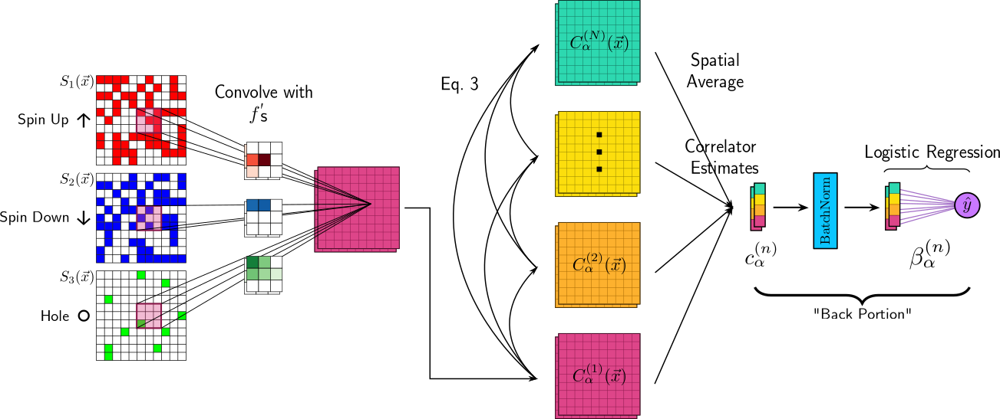

# Interpretable ML for Quantum Gas Microscopy



This repository contains all code used to produce the results of the paper _"Correlator Convolutional
Neural Networks: An Interpretable Architecture for Image-like Quantum Matter Data"_.

The main scripts to interact with are `train.py` and `reduced_lassosearch.py`, with extra scripts providing helper
utilities residing in `scripts/`. All scripts can be run with the `-h` flag to provide a helper message providing
usage details.

### Requirements, Reproducibility

To run our code, the following libraries are required:
```
    numpy, torch, matplotlib, scikit-learn, tqdm
```

We have taken as many steps to allow direct reproducibility as possible, though
[the Pytorch documentation](https://pytorch.org/docs/stable/notes/randomness.html) does not guarantee
completely reproducible training runs across different hardware.
We include information about specific Python and Torch versions below,
 as well as hardware information, though it should work on any Python or Torch of higher versions.

```
    GPU: Quadro GV100
    Python: 3.83
    torch: 1.5.0
```

### Data Layout

The main scripts assume data resides in a directory named `QGasData` living in the same directory
as the repository. However, this can be changed by setting the `--data-dir` flag. Within this directory, different
datasets are assumed to live in separate directories, each prefixed with `Dataset`, following by the name of the dataset.

Within each of these directories, data files can be named anything, as long as they are suffixed with the doping level,
such as `datafile_d9.pkl` for a file containing 9% doping data.

An example layout is below:

```
QGasML/
QGasData/
    DatasetString/
        string_d0.pkl
        ...
    DatasetPi/
        pi_d0.pkl
        ...
    DatasetExp/
        exp_d0.pkl
        ...
```

Each of these `.pkl` files contain a serialized dictionary containing the snapshots and
  the indices defining the train/val split of the structure:

```buildoutcfg
{
    "snapshots": List[np.ndarray[Float64]],
    "train_idxs": np.ndarray[Int],
    "val_idxs": np.ndarray[Int],
}
```

When running the main scripts, the two datasets to classify between are set by the flags `-a` and `-b`, and the doping
level by `--doping-level`. For the above directory layout, we can classify between 9% doping `String` and `Pi` data
using the flags `-a String -b Pi --doping-level 9.0`.

### Phase 1: `train.py`

This script implements the first phase of training, where a CCNN is trained to classify between two sets of data. Many
hyperparameters can be set using command line arguments, see the output of running with the `-h` flag. The model
examined in Figs. 3 and 4 was produced using the command:

`python3 train.py -a FullInfoAS -b FullInfoPi --batch-size 1024 
--epochs 1000 --lr 0.005 --l1-loss 0.005 --num-filts 2 --seed 4444`

This script will log information about its progress both to stdout and a logfile in the directory specified by
`--log-root` (by default, `log/`). After completion, a saved model will be output to the directory specified by
`--save-root` (by default, `model/`).

To look at the learned filters, run the script `scripts/extract_filts.py` on the saved model to
examine, which will extract the filters to a serialized numpy array whose name is given as an
argument. An example execution is:

`python3 ./scripts/extract_filts model_file_name.pt filter_file_name.npy`

These filters can be visualized using `./scripts/plot_filters.npy`,
making sure to provide the `--correlator` argument to take the absolute value, and
scale each filter, etc., to accurately represent each pixel's importance.


### Phase 2: `reduced_lassosearch.py`

This script implements the second phase, producing regularization paths from a trained CCNN. This
script can be run as `python3 reduced_lassosearch.py <model_file> <lo_log_lamb> <hi_log_lamb>`,
where `<model_file>` is the `.pt` file produced following training and `lo_log_lamb`, `hi_log_lamb`
are the lower and upper bounds on the `log(1/lambda)` to explore.

Other important keyword arguments include `--steps` which sets how many gridpoints are evalauted in
log space between `log(1/lo_log_lamb)` and `log(1/hi_log_lamb)`, and `--save` which saves the
results to a file with the given prefix. For example, running with `--save paths/reg_path`
will produce files `paths/reg_path.pkl` and `paths/reg_path.png`, the first being a pickled
dictionary of results and the second being a plot of the regularization path. The scaling of the
loss on each order as described in Sec.II of the supplement can be set using
`--scale-loss 1.0 1.1 1.2 1.3`.

This plot can be re-generated using `scripts/path_plotter.py`, passing the produced `.pkl`
file as an argument and setting `--correlator` to get appropriate coloring.


A legend of the color coding when the `--correlator` argument is set is below. If you use more
filters or orders than this (or any of the X's), it will still plot, but those lines could
be any color.


