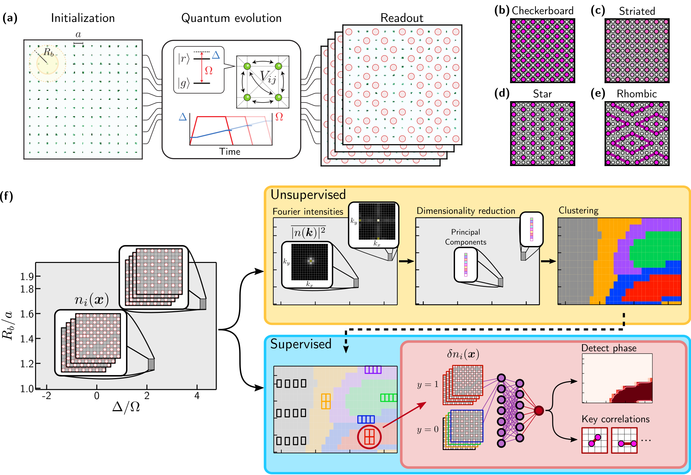
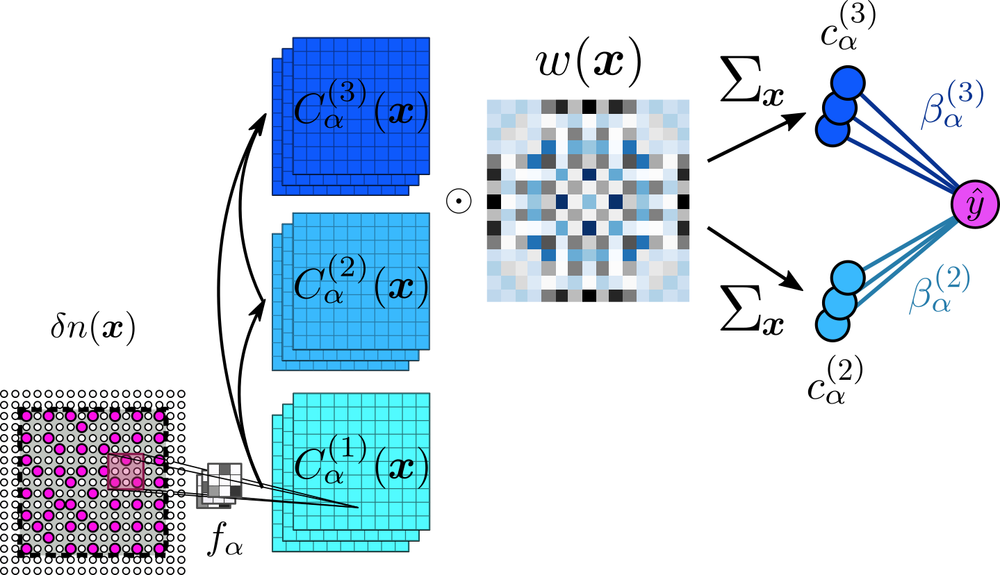
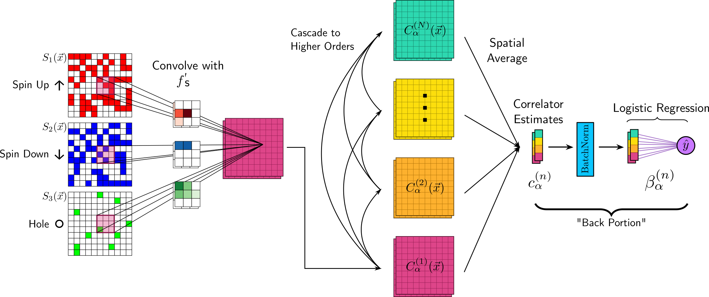
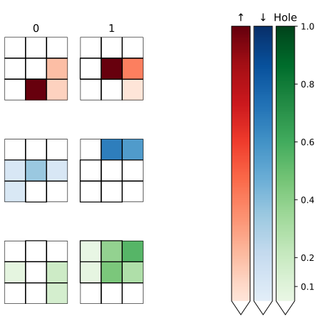
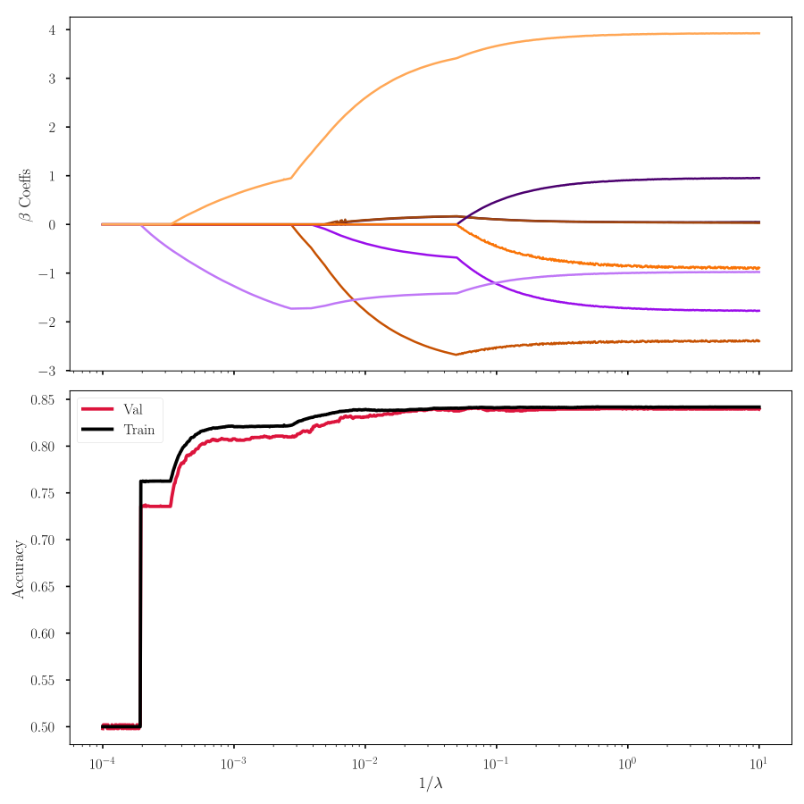
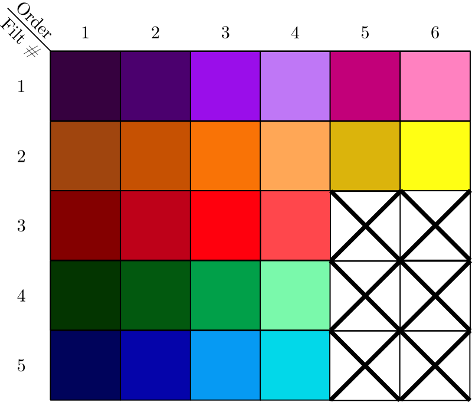

# Correlator Convolutional Neural Networks: Interpretable Shallow ConvNets For Physical Data


This repository contains code used to produce the main results of the papers:
1.  [_"Machine learning discovery of new phases in programmable quantum simulator snapshots"_ (2021)](https://arxiv.org/abs/2112.10789)
2.  [_"Correlator Convolutional Neural Networks As An Interpretable Architecture for Image-like Quantum Matter Data"_ (2021)](https://www.nature.com/articles/s41467-021-23952-w)

### Requirements, Reproducibility

To run our code, the following libraries are required:
```
    numpy, torch, matplotlib, scikit-learn, tqdm
```

We have taken as many steps to allow direct reproducibility as possible, though
[the Pytorch documentation](https://pytorch.org/docs/stable/notes/randomness.html) does not guarantee
completely reproducible training runs across different hardware.
We include information about specific Python and Torch versions below,
 as well as hardware information, though it should work on any Python or Torch of higher versions.

```
    GPU: Quadro GV100
    Python: 3.83
    torch: 1.5.0
```

The commits used to produce the results of each paper have been tagged by the corresponding arXiv ID.

## (1) Detecting phases in square-lattice Rydberg-atom snapshots
### [*Paper*](https://arxiv.org/abs/2112.10789)



In this paper, we use our interpretable convolutional networks to characterize different phases
which appear in a square-lattice Rydberg Hamiltonian, realized by a
[programmable quantum simulator](https://www.nature.com/articles/s41586-021-03582-4).
We take a two-stage approach. First,
an unsupervised algorithm is used to determine the number of phases present and their rough
regions of support in parameter space. It is not crucial that this stage is fully interpretable -
we can think of it as providing  a "suggested" phase diagram to follow up on. In the second phase,
we try to nail the phase diagram and figure out exactly what each phase is by training fully-interpretable
classifiers to classify snapshots sampled from each phase against snapshots from all other phases. The
first stage informs us as to where we should be sampling to form the training datasets for each phase.

To discover how many phases exist in the first place (and get some insight into some of them), we first
do some simple unsupervised learning:

1. Perform some feature engineering by measuring average Fourier intensities of the snapshots, under a
    normalization scheme which ensures the intensities are invariant under mean density shifts.
2. Perform PCA as a dimensionality reduction, and to visualize how the intensities vary across parameter
    space.
3. Cluster using a Gaussian mixture model.

A heuristic which informs us as the correct number of clusters for step 3 is the
[Bayesian information criterion](https://en.wikipedia.org/wiki/Bayesian_information_criterion). Though,
we emphasize that this unsupervised stage is where it is critical to have a "physicist in the loop".
For different systems, the feature engineering stage will be entirely different, or more complex
dimensionality reduction techniques than PCA may be necessary.

Our entire unsupervised pipeline is implemented by `scripts/rydberg_unsup.py`, which needs only the
path to the directory containing the Rydberg snapshots. (Data to be made public soon.)

At this point, we have a rough idea of how many phases are present in the diagram, and perhaps
some clues as to what some of the phases are. Different unsupervised approaches will vary
in their interpretability and the exact proposed phase diagrams. We don't _need_ interpretability
from the unsupervised stage -- that's what the second stage is for. Though, it certainly is nice!

In the second stage, we characterize and obtain order parameters for each phase by training interpretable
classifiers. The script `train_ovr.py` performs this by training CCNNs to classify each phase individually
against all of the rest of the phases ("One-vs-Rest"/"OVR" training). For details on the CCNN
architecutre, see the [paper](https://arxiv.org/abs/2112.10789). 



This script requires a config
file which provides various information - where the data resides, which model to use, parameters
for that model, where to write logs, etc. Example configuration files are in `config/`. After
training, the final trained model is saved into `model/`.

Scripts and notebooks which help interpret models reside in `scripts/` and `notebook/`, respectively.
All scripts can be run with the `-h` flag to provide a helper message providing
usage details. (Notebook to be pushed soon.)

## (2) Classifying ansatz states of the Fermi-Hubbard model
### [*Paper*](https://www.nature.com/articles/s41467-021-23952-w)



This was the first paper where we introduced the CCNN architecture, and applied it to discriminate
quantum snapshots sampled from two quantum state ansatzes for the lightly doped Fermi-Hubbard model.
The trained model is thoroughly interrogated using LASSO regularization path analysis, revealing the
multi-spin motifs characterizing each quantum state.

The main scripts to interact with are `train.py` and `lassopath.py`, with extra scripts providing helper
utilities residing in `scripts/`. All scripts can be run with the `-h` flag to provide a helper message providing
usage details. The `train.py` script has been updated to accept config files just as the `train_ovr.py`
script for paper (1) does. The config which reproduces the paper is `config/string_pi.ini`.

### Data Layout

The `string_pi.ini` config assumes data resides in a directory named `QGasData`
living in the same directory as the repository. However, this can be changed by editing the config
to point to the data directory. Within this directory, different datasets are assumed to live in
separate directories, each prefixed with `Dataset`, following by the name of the dataset.

Within each of these directories, data files can be named anything, as long as they are suffixed
with the doping level, such as `datafile_d9.pkl` for a file containing 9% doping data.

An example layout is below:

```
QGasML/
QGasData/
    DatasetString/
        string_d0.pkl
        ...
    DatasetPi/
        pi_d0.pkl
        ...
    DatasetExp/
        exp_d0.pkl
        ...
```

Each of these `.pkl` files contain a serialized dictionary containing the snapshots and
  the indices defining the train/val split of the structure:

```buildoutcfg
{
    "snapshots": List[np.ndarray[Float64]],
    "train_idxs": np.ndarray[Int],
    "val_idxs": np.ndarray[Int],
}
```

When running the main scripts, the two datasets to classify between are set by the flags `-a` and `-b`, and the doping
level by `--doping-level`. For the above directory layout, we can classify between 9% doping `String` and `Pi` data
using the flags `-a String -b Pi --doping-level 9.0`.

### Phase 1: `train.py`

This script implements the first phase of training, where a CCNN is trained to classify between two sets of data. Many
hyperparameters can be set using command line arguments, see the output of running with the `-h` flag. The model
examined in Figs. 3 and 4 was produced using the command:

`python3 train.py -a FullInfoAS -b FullInfoPi --batch-size 1024 
--epochs 1000 --lr 0.005 --l1-loss 0.005 --num-filts 2 --seed 4444`

Alternatively, just supply the path to the `string_pi.ini` config.

This script will log information about its progress both to stdout and a logfile in the directory specified by
`--log-root` (by default, `log/`). After completion, a saved model will be output to the directory specified by
`--save-root` (by default, `model/`).

To look at the learned filters, run the script `scripts/extract_filts.py` on the saved model to
examine, which will extract the filters to a serialized numpy array whose name is given as an
argument. An example execution is:

`python3 ./scripts/extract_filts model_file_name.pt filter_file_name.npy`

These filters can be visualized using `./scripts/plot_filters.npy`,
making sure to provide the `--correlator` argument to take the absolute value, and
scale each filter, etc., to accurately represent each pixel's importance.



### Phase 2: `lassopath.py`

This script implements the second phase, producing regularization paths from a trained CCNN. This
script can be run as `python3 lassopath.py <model_file> <lo_log_lamb> <hi_log_lamb>`,
where `<model_file>` is the `.pt` file produced following training and `lo_log_lamb`, `hi_log_lamb`
are the lower and upper bounds on the `log(1/lambda)` to explore.

Other important keyword arguments include `--steps` which sets how many gridpoints are evalauted in
log space between `log(1/lo_log_lamb)` and `log(1/hi_log_lamb)`, and `--save` which saves the
results to a file with the given prefix. For example, running with `--save paths/reg_path`
will produce files `paths/reg_path.pkl` and `paths/reg_path.png`, the first being a pickled
dictionary of results and the second being a plot of the regularization path. The scaling of the
loss on each order as described in Sec.II of the supplement can be set using
`--scale-loss 1.0 1.1 1.2 1.3`.

This plot can be re-generated using `scripts/path_plotter.py`, passing the produced `.pkl`
file as an argument and setting `--correlator` to get appropriate coloring.



A legend of the color coding when the `--correlator` argument is set is below. If you use more
filters or orders than this (or any of the X's), it will still plot, but those lines could
be any color.



